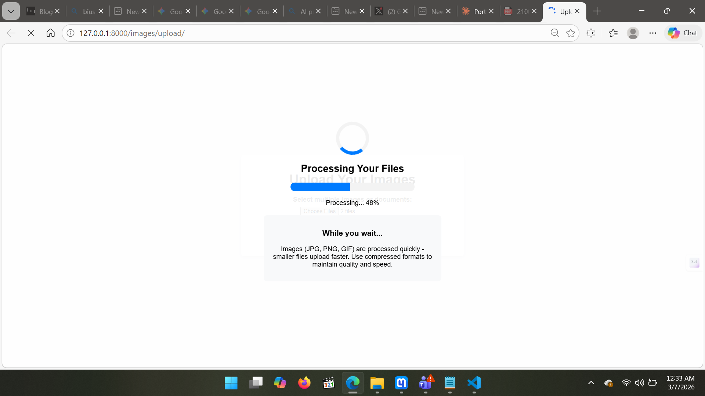
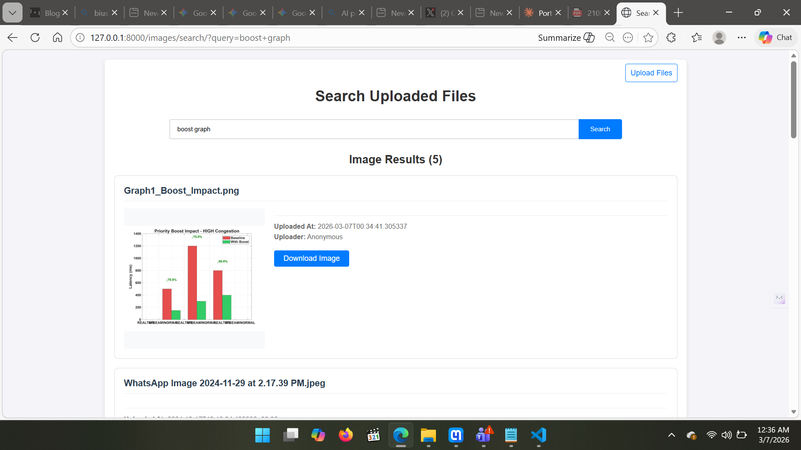
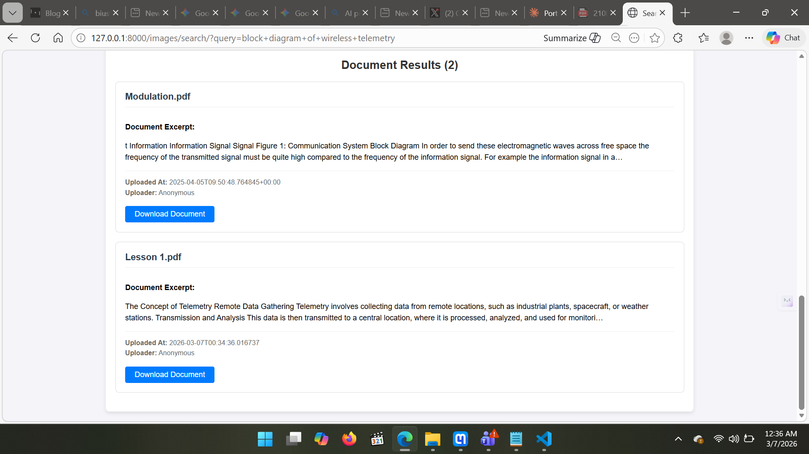
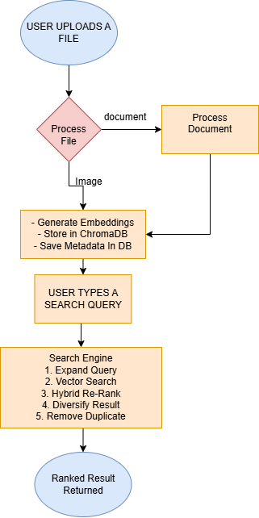

# 🔍 AI File Search — Multimodal Search Engine

> Upload images and documents, then find them instantly using natural language. Powered by vector embeddings, semantic search, and hybrid BM25 re-ranking.


---

## 📸 Screenshots

### Upload Page



---

### Search Results — Images



---

### Search Results — Documents



---

## 📌 What Is This?

**AI File Search** is a full-stack Django application that makes finding uploaded files effortless. Instead of scrolling through endless folders, users type a natural language query and instantly get back the most relevant images, PDFs, Word documents, and PowerPoint files.

Under the hood, it uses **OpenCLIP embeddings** stored in **ChromaDB** for deep semantic understanding, combined with **BM25 keyword scoring** and **Maximal Marginal Relevance (MMR)** diversification — the same techniques used in production search systems.

Built to explore AI-powered search, vector databases, and document processing pipelines.

---

## ✨ Features

- 📁 **Multi-format uploads** — JPG, PNG, GIF, PDF, DOCX, PPTX, TXT
- 🧠 **Semantic search** — finds files by meaning, not just exact keywords, using OpenCLIP vector embeddings
- ⚖️ **Hybrid re-ranking** — blends semantic similarity with BM25 keyword matching for more accurate results
- 📄 **Smart document chunking** — splits large documents into overlapping chunks with sentence-boundary awareness
- 🔄 **Result diversification** — uses Maximal Marginal Relevance (MMR) to avoid returning duplicate results
- 📈 **Freshness boost** — recently uploaded files get a subtle ranking advantage
- 🔍 **Query expansion** — automatically broadens queries using configurable synonyms
- 💾 **Persistent vector store** — ChromaDB saves embeddings to disk; no re-indexing needed on restart
- 📥 **File download** — users can download any matched file directly from search results

---

## 🛠️ Tech Stack

| Layer | Technology |
|---|---|
| **Backend** | Django 4.x, Python 3.10+ |
| **Vector Database** | ChromaDB (local, persistent) |
| **Embeddings** | OpenCLIP (via ChromaDB embedding functions) |
| **Keyword Search** | BM25Okapi (`rank_bm25`) |
| **Document Parsing** | Unstructured.io |
| **Image Processing** | Pillow (PIL) |
| **Database** | SQLite |
| **Frontend** | Django Templates, Vanilla CSS & JS |

---

## 🏗️ How It Works


---

### Flowchart



---

```
USER UPLOADS A FILE
        │
        ▼
┌─────────────────────┐
│    Django View      │  ← upload_image()
│    FileProcessor    │
└────────┬────────────┘
         │
    ┌────┴─────┐
    │          │
    ▼          ▼
 Image      Document
    │          │
    │    ┌─────────────────────┐
    │    │ EnhancedDocument    │
    │    │ Processor           │
    │    │  • Extract text     │
    │    │  • Split into chunks│
    │    │  • Generate metadata│
    │    └─────────┬───────────┘
    │              │
    └──────┬───────┘
           ▼
┌──────────────────────────┐
│  EnhancedMultimodal      │
│  SearchEngine            │
│  • Generate embeddings   │
│  • Store in ChromaDB     │
│  • Save metadata in DB   │
└──────────────────────────┘

USER TYPES A SEARCH QUERY
        │
        ▼
┌─────────────────────────────┐
│  Search Engine              │
│  1. Expand query (synonyms) │
│  2. Vector search ChromaDB  │
│  3. Hybrid re-rank (BM25)   │
│  4. Diversify results (MMR) │
│  5. Remove duplicates       │
└─────────────┬───────────────┘
              ▼
     Ranked Results Returned
     (Images + Documents)
```

---


## 📖 Usage

**Upload files** → Go to `/images/upload/`, select your files, click Upload. The app extracts text, generates embeddings, and indexes everything automatically.

**Search** → Go to `/images/search/`, type a natural language query (e.g. *"biology notes"* or *"landscape photos"*), and get ranked results. Click **Download** on any result to save the file.

---


## 🧠 Key Engineering Decisions

**Hybrid Search (Semantic + BM25)**
Pure semantic search misses exact keyword matches like course codes. Pure keyword search misses intent. This project combines both, with the weighting shifting dynamically based on query length — short queries lean on semantic, longer queries lean on BM25.

**Maximal Marginal Relevance (MMR)**
Without MMR, all top results could be different chunks from the same document. MMR penalises results too similar to ones already selected, ensuring a variety of sources appear rather than one file repeated five times.

**Thread-Safe Singleton**
`EnhancedMultimodalSearchEngine` uses a singleton with a threading lock so ChromaDB is initialised only once per server process — preventing duplicate connections and race conditions.

**Shared Vector Space for Images and Text**
OpenCLIP embeds both images and text into the same vector space, meaning a text query can return both matching documents *and* matching images — true multimodal search.

---

## ⚠️ Known Limitations

- No user authentication — all uploads are visible to all users
- Files stored locally (does not scale to production)
- Large uploads block the server (no background task queue yet)
- SQLite is for development only

---

## 🗺️ Roadmap

- [ ] User authentication and private file ownership
- [ ] Async processing with Celery + Redis
- [ ] Docker + docker-compose setup
- [ ] Cloud storage (AWS S3 or Cloudflare R2)
- [ ] OCR for scanned PDFs (Tesseract)
- [ ] REST API with Django REST Framework
- [ ] Unit and integration tests

---

## 📄 License

MIT License — see the [LICENSE](LICENSE) file for details.

---

## 👋 About Me

Hi, I'm **Simangaliso** — a developer interested in AI-powered applications and backend engineering.


- 📧 tbsmesh10@gmail.com

---

*If you found this project useful or interesting, a ⭐ on GitHub is appreciated — thank you!*
